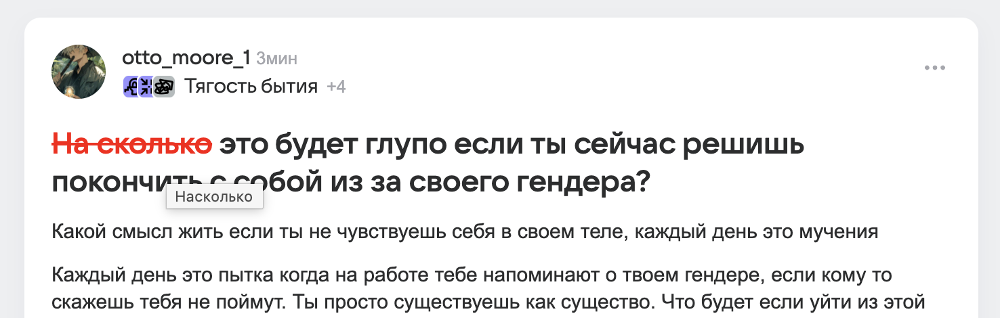

# 🖍️ Красная Паста (Red Paste)

  

**Красная Паста** — это легковесное расширение для Google Chrome, которое позволяет имитировать работу редактора или учителя прямо на веб-страницах. Выделяйте ошибки, зачеркивайте их красным цветом и оставляйте комментарии, которые появляются при наведении.

> **Note:** Это расширение работает локально (DOM-манипуляции). Изменения видны только вам и исчезнут после перезагрузки страницы.

---

## ✨ Возможности

*   **Интеграция в контекстное меню:** Просто выделите текст и нажмите правую кнопку мыши.
*   **Визуальный стиль:** Текст зачеркивается красной линией (стиль `line-through`), а сам цвет текста становится красным.
*   **Интерактивные комментарии:** Всплывающее окно (`prompt`) позволяет ввести пояснение к исправлению.
*   **Подсказки:** Комментарий отображается в нативном `tooltip` при наведении курсора на исправленный текст.
*   **Manifest V3:** Использует современный стандарт расширений Chrome (Service Workers).

---

## 📸 Демонстрация



---

## 🚀 Установка

Поскольку расширение пока не опубликовано в Chrome Web Store, его можно установить в режиме разработчика:

1.  **Скачайте код:**
    Клонируйте этот репозиторий или скачайте ZIP-архив.
    ```bash
    git clone https://github.com/ВАШ_НИКНЕЙМ/red-paste-plugin.git
    ```

2.  **Откройте управление расширениями:**
    В адресной строке Chrome введите:
    `chrome://extensions/`

3.  **Включите режим разработчика:**
    Переключите тумблер **Developer mode** («Режим разработчика») в правом верхнем углу.

4.  **Загрузите расширение:**
    Нажмите кнопку **Load unpacked** («Загрузить распакованное расширение») и выберите папку с файлами проекта (`manifest.json` должен быть внутри).

---

## 🛠 Использование

1.  Откройте любую веб-страницу (например, статью в блоге).
2.  Выделите фрагмент текста, который хотите «исправить».
3.  Нажмите **правую кнопку мыши**.
4.  Выберите пункт **«Красная паста»**.
5.  В появившемся окне введите ваш комментарий (например: *"Здесь пропущена запятая"*).
6.  Нажмите **ОК**.
7.  Наведите курсор на красный текст, чтобы увидеть ваш комментарий.

---

## 📂 Структура проекта

*   `manifest.json` — Конфигурация расширения, права доступа и настройки.
*   `background.js` — Service Worker. Отвечает за создание контекстного меню и передачу команд.
*   `content.js` — Скрипт, который внедряется на страницу. Обрабатывает выделение текста и применяет CSS-стили.

---

## 🤝 Вклад в проект (Contributing)

Если у вас есть идеи по улучшению (например, возможность сохранения заметок или выбор цвета):
1.  Сделайте Fork репозитория.
2.  Внесите изменения.
3.  Создайте Pull Request.

---

## 📄 Лицензия

Этот проект распространяется под лицензией MIT.